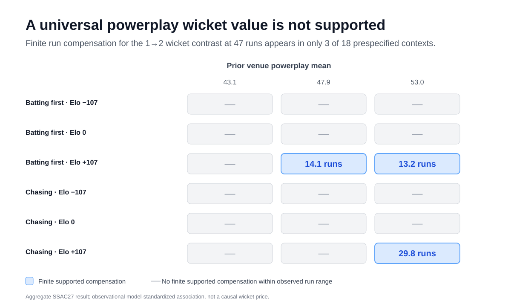

# What Is a Powerplay Wicket Worth?
## Context-Dependent Run-Wicket Tradeoffs in ODI Cricket

[](https://github.com/anshbalusa-ui/odi-powerplay-research/actions/workflows/tests.yml)

**SSAC27 open-source research repository.** This project studies the context-dependent association between first-10-over runs, wickets lost, and match win probability in men's One Day Internationals (ODIs). The current submission analysis is observational: it estimates a run-wicket exchange rate within development-data support and does **not** claim a causal coaching rule or universal wicket price.


> ### Key result
> A finite run compensation for losing a second powerplay wicket was supported in only **3 of 18 prespecified match contexts**: **14.1, 13.2, and 29.8 additional runs**. In the other **15 contexts**, no finite compensation was supported within the observed run range. The central finding is therefore that **one universal wicket-to-runs conversion is not supported across these contexts**.



## Introduction

A powerplay score is not defined by runs alone. Scoring faster can improve a team's position, while losing wickets reduces resources for the remaining 40 overs. The value of that tradeoff can also depend on match context.

The primary research question is:

> Among men's ODIs, how many additional first-ten-over runs are associated with the same modeled match win probability as losing one additional wicket, and how does that run-wicket exchange rate vary with innings order, pre-match team strength, and prior venue scoring environment?

In plain language: **What is a powerplay wicket worth in runs, and does that value change with match context?**

## Methods

The corrected SSAC27 analysis uses **942 clean men's ODI matches (1,884 paired innings) from 2015–2024** from the official September 29 amended Cricsheet source. Development contains **871 matches / 1,742 innings through 2023** and untouched temporal validation contains **71 matches / 142 innings from 2024**. Both innings from a match remain together in splits and resamples.

The primary estimand is the nonnegative, bounded run increment `d` solving `p(R+d, W+1, C) = p(R, W, C)`

at **47 powerplay runs** and a change from **one to two wickets**, for context (C). The frozen primary model is an L2 logistic regression with six prespecified interactions using innings order, leakage-safe pre-match Elo strength, and strictly earlier-date prior venue scoring environment. Development uncertainty uses whole-match refits; 2024 validation uncertainty uses whole-match resampling.

Pitch measurements are excluded from this analysis. No 2025+ match outcomes were loaded, trained on, or scored.

## Results

A finite run compensation for the primary 1→2 wicket contrast is supported in only **3 of 18** prespecified contexts:

| Innings | Elo difference | Prior venue PP mean | Additional runs | Conditional 95% interval |
|---|---:|---:|---:|---:|
| Batting first | +107.473 | 47.908 | **14.143** | 4.124–18.450 |
| Batting first | +107.473 | 53.014 | **13.248** | 4.713–17.481 |
| Chasing | +107.473 | 53.014 | **29.763** | 13.844–30.934 |

In the other **15 contexts**, no finite compensation is supported within the observed run range. Those cases are **undefined rather than zero**; they are part of the finding, not missing estimates to be averaged into a universal wicket value.

At neutral Elo and median prior-venue scoring, moving from one to two wickets at 47 runs changes modeled win probability by **−10.505 percentage points batting first** and **−15.690 points chasing**. The paired first-minus-chase difference is **+5.185 points (95% interval −0.457 to +11.182)**, so the interval includes zero.

On untouched 2024 validation, the primary model has **ROC-AUC 0.6626 (95% interval 0.5461–0.7681)**, compared with **0.6737** for the additive comparator and **0.6784** for the four-term interaction comparator. The primary model does **not** improve held-out AUC or log loss.

## Conclusion

The central result is that a powerplay wicket does **not** have one supported run value across match contexts. A finite exchange rate appears only in a small subset of the prespecified contexts, and its magnitude varies substantially when it is supported. The estimates are **conditional observational associations**, not causal effects or instructions to trade wickets for runs.

## Start here

For reviewers or researchers entering the repository for the first time:

1. **[Final SSAC27 abstract](docs/ssac27_abstract_final.md)** — submission-ready abstract text.
2. **[Submission source of truth](docs/ssac27_submission_source_of_truth.md)** — current title, claim boundary, figure/table inputs, and evidence navigation.
3. **[Verified numerical handoff](docs/ssac27_numeric_handoff.md)** — exact corrected numbers, uncertainty, provenance, and QA.
4. **[Data availability & reproduction](docs/ssac27_data_availability.md)** — public input source, frozen source hash, cohort selection, and exact reproduction path.
5. **[Sloan-style manuscript structure](docs/ssac27_manuscript_structure.md)** — current full-paper organization without changing the research claims.
6. **[Current results](docs/results.md)** — corrected submission narrative followed by clearly marked historical material.
7. **[Statistical specification](docs/ssac27_tradeoff_statistical_spec.md)** — frozen modeling and uncertainty specification.
8. **[Data audit](docs/ssac27_tradeoff_data_audit.md)** — cohort and extraction audit.
9. **[Submission checklist](docs/ssac27_submission_checklist.md)** — final portal and claim checks.
10. **[Documentation map](docs/README.md)** — current, historical, and secondary documents grouped by purpose.

## Reproduce the current SSAC27 analysis

Use Python 3.11. The locked-safe amended-source path refuses to materialize 2025+ match members and checks the frozen September 29 source identity.

```bash
python3.11 -m venv .venv
.venv/bin/python -m pip install -e .

test ! -e data/raw/cricsheet/odis_json_20260929.zip &&
  curl -fL https://cricsheet.org/downloads/odis_json.zip \
    -o data/raw/cricsheet/odis_json_20260929.zip

.venv/bin/python scripts/materialize_ssac27_unlocked_raw.py
.venv/bin/python scripts/build_clean_dataset.py \
  --input-dir data/raw/cricsheet/unlocked_20260929
.venv/bin/python scripts/build_team_strength.py
.venv/bin/python scripts/build_venue_conditions.py
.venv/bin/python scripts/build_model_table.py
.venv/bin/python scripts/audit_full_cohort_analysis.py \
  --summary-output artifacts/ssac27_tradeoff/data_audit.json
.venv/bin/python scripts/run_ssac27_tradeoff_pipeline.py
.venv/bin/python scripts/audit_ssac27_tradeoff_results.py
.venv/bin/python scripts/release_ssac27_tradeoff_results.py
.venv/bin/python -m unittest discover -s tests -v
.venv/bin/python -m compileall -q src scripts
```

The final local corrected release is generated under `artifacts/ssac27_tradeoff/`. It includes context exchange rates, paired comparisons, validation results, uncertainty summaries, QA, hashes, and the supported-results figure. Derived model artifacts, predictions, and figures remain ignored by Git pending third-party rights review; aggregate verified evidence is committed under `artifacts/abstract/`.

## Repository structure

```text
odi-powerplay-research/
├── README.md                    # reviewer-facing research summary and entry point
├── docs/
│   ├── README.md                # documentation map
│   ├── ssac27_*                 # current submission protocol, evidence, audits, and paper structure
│   ├── research_*               # broader research framing and design
│   ├── results.md               # current results first; historical results clearly separated
│   ├── literature/              # prior-art review
│   ├── pitch_*                  # separate secondary/historical pitch-measurement work
│   └── archive/                 # preserved superseded front-door material
├── artifacts/
│   └── abstract/                # tracked aggregate SSAC27 evidence and validation ledger
├── data/                        # source registries/manual inputs; generated/raw releases governed by ignore rules
├── scripts/                     # reproducible extraction, modeling, audit, and release commands
├── src/odi_powerplay/           # reusable research code
├── tests/                       # regression, leakage, extraction, modeling, and release tests
├── config/                      # frozen configuration
└── pyproject.toml               # Python environment and package metadata
```

## Current submission vs. historical work

The **current SSAC27 submission evidence** is the corrected 942-match amended-source run-wicket tradeoff analysis described above.

The repository also preserves earlier broad-cohort modeling and historical pitch-report work for provenance. Those materials are intentionally retained, but they are **not current submission evidence**. The separate pre-match pitch-expectation measurement track remains unapproved for outcome interpretation and is excluded from the current tradeoff result.

The pre-restructure README, including the full historical narrative previously shown on the repository front page, is preserved at [`docs/archive/README_pre_sloan_restructure_2026-09-30.md`](docs/archive/README_pre_sloan_restructure_2026-09-30.md).

## Data, rights, and reproducibility

Match data originate from Cricsheet. The current analysis uses a separately identified and checksummed September 29 archive; the unavailable September 10 archive is not claimed as reproduced. Raw third-party data are not relicensed by this repository.

See:
- [data availability and exact reproduction](docs/ssac27_data_availability.md)
- [limitations and rights boundaries](docs/limitations.md)
- [data dictionary](docs/data_dictionary.md)
- [transformation log](docs/transformation_log.md)
- [source documentation](docs/sources.md)

## Licence

Original code and documentation in this repository are released under the MIT Licence. Third-party data and report content remain governed by their respective licences and terms.
